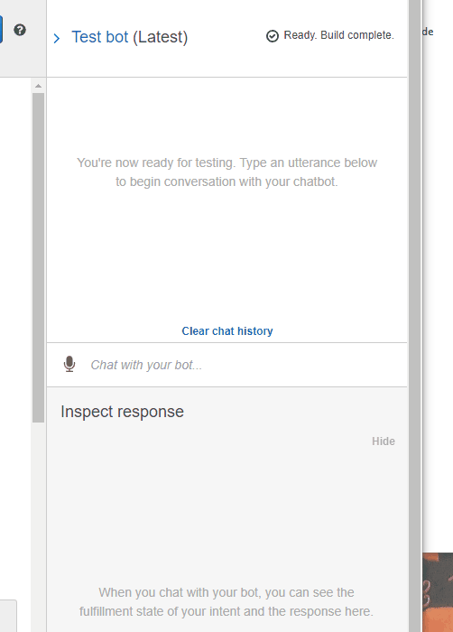

# Unit 13 Homework Assignment - The Power of the Cloud and Unsupervised Learning

## Assignment by Dorothy Doutre 


## Assigment Summary (option1):

For this assignment I am hired as a digital transformation consultant by one of the most prominent retirement plan providers in the country; they want to increase their client portfolio, especially by engaging young people. Since machine learning and NLP are disrupting finance to improve customer experience, you decide to create a robo advisor that could be used by customers or potential new customers to get investment portfolio recommendations for retirement.

The following techniques utilised to complete this assignment:

###  Amazon Web Services:

```
Initial Robo Advisor Configuration.

Build and Test the Robo Advisor.

Enhance the Robo Advisor with an Amazon Lambda Function.
```


### Technologies used:
- GitBash
- Python
- Amazon Lex
- Amazon Lambda
- VS Code

---

## Assignment findings

Short Clip as shown below:

